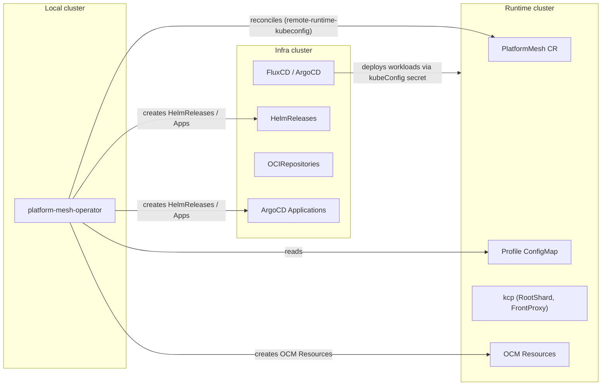

> [!WARNING]
> This Repository is under development and not ready for productive use. It is in an alpha stage. That means APIs and concepts may change on short notice including breaking changes or complete removal of apis.

# platform-mesh-operator
[](https://scorecard.dev/viewer/?uri=github.com/platform-mesh/platform-mesh-operator)

The platform-mesh-operator bootstraps and reconciles platform-mesh environments. It reconciles a `Kind: PlatformMesh` resource which looks like this:

```yaml
apiVersion: core.platform-mesh.io/v1alpha1
kind: PlatformMesh
metadata:
  name: platform-mesh-sample
  namespace: platform-mesh-system
spec:
  kcp:
    providerConnections:
    - endpointSliceName: core.platform-mesh.io
      path: root:platform-mesh-system
      secret: platform-mesh-operator-kubeconfig
      adminAuth: true
```

## PlatformMesh Resource Configuration

The `PlatformMesh` resource provides a comprehensive way to configure your platform-mesh environment. Below is a detailed explanation of each section and field available in the resource specification:

### Profile ConfigMap

The operator reads its deployment configuration from a profile ConfigMap. By default it looks for a ConfigMap named `<instance-name>-profile` in the instance namespace. This can be overridden:

```yaml
spec:
  profileConfigMap:
    name: platform-mesh-profile
    namespace: platform-mesh-system
```

The PlatformMesh resource and its profile ConfigMap are linked by naming convention: a PlatformMesh instance named `foo` in namespace `bar` expects a ConfigMap named `foo-profile` in the same namespace. Alternatively, use `spec.profileConfigMap` to point to a specific ConfigMap by name and namespace. Both resources must live on the same cluster (the runtime cluster in remote deployments).

The ConfigMap must contain a `profile.yaml` key with two top-level sections: `infra` and `components`. The operator renders Go templates inside the profile at reconcile time, substituting variables like `{{ .baseDomainPort }}` and `{{ .baseDomain }}` from the exposure configuration.

### Exposure Configuration

The `exposure` section configures how services are exposed externally:

```yaml
spec:
  exposure:
    baseDomain: example.com       # Base domain for exposure
    port: 443                     # Port to expose services on
    protocol: https               # Protocol (http/https)
```

### KCP Configuration

The `kcp` section manages KCP (Kubernetes Control Plane) setup and connections:

#### Provider Connections

Provider connections define how platform-mesh connects to provider workspaces:

```yaml
spec:
  kcp:
    providerConnections:
    - endpointSliceName: core.platform-mesh.io   # APIExportEndpointSlice name (for admin auth)
      path: root:platform-mesh-system            # Path in KCP workspace hierarchy
      secret: provider-kubeconfig                # Secret to store kubeconfig
      adminAuth: true                            # Use admin cert-based auth (default: true)

    # Scoped provider connections (uses ServiceAccount token + RBAC from APIExport)
    - apiExportName: core.platform-mesh.io       # APIExport name (for scoped auth)
      path: root:platform-mesh-system
      secret: scoped-kubeconfig
      adminAuth: false                           # Use scoped kubeconfig

    # Additional provider connections
    extraProviderConnections:
    - endpointSliceName: auxiliary.platform-mesh.io
      path: root:auxiliary-system
      secret: auxiliary-kubeconfig
```

#### Extra Workspaces

```yaml
spec:
  kcp:
    extraWorkspaces:
    - path: "root:orgs:my-new-workspace"
      type:
        name: "universal"
        path: "root"
```

#### Default API Bindings

Configure additional default API bindings for workspaces:

```yaml
spec:
  kcp:
    extraDefaultAPIBindings:
    - workspaceTypePath: root:types
      export: services
      path: root:exports
```

### OCM Configuration

The `ocm` section configures Open Component Model integration:

```yaml
spec:
  ocm:
    repo:
      name: platform-mesh              # Repository name (defaults to "platform-mesh")
    component:
      name: platform-mesh              # Component name (defaults to "platform-mesh")
    referencePath:                     # Path of references to follow
    - name: core
```

### Values and InfraValues

Custom values can be provided for components and infra respectively:

```yaml
spec:
  values:
    key1: value1
  infraValues:
    key2: value2
```

These are merged with the profile's `components` and `infra` sections when rendering Go templates.

### Feature Toggles

Certain features can be enabled or disabled using feature toggles in the PlatformMesh resource specification:

```yaml
spec:
  featureToggles:
  - name: "<feature-name>"
    parameters:
      key: value
```

#### Available Feature Toggles

| Feature Toggle Name | Description |
|---------------------|-------------|
| `feature-enable-getting-started` | Applies the ContentConfiguration resources required for the Getting Started UI page |
| `feature-accounts-in-accounts` | Applies the ContentConfiguration resources for displaying accounts within the account context |
| `feature-enable-account-iam-ui` | Applies the ContentConfiguration resources for the IAM UI Members section at the account level |
| `feature-disable-email-verification` | Disables email verification requirement in WorkspaceAuthenticationConfiguration |
| `feature-disable-contentconfigurations` | Disables loading of all ContentConfiguration manifests during KCP setup |

### Wait Configuration

The wait behavior can be customized through the `spec.wait` section:

```yaml
spec:
  wait:
    resourceTypes:
    - apiVersions:
        versions: ["v2"]
      groupKind:
        group: "helm.toolkit.fluxcd.io"
        kind: "HelmRelease"
      namespace: "default"
      labelSelector:
        matchExpressions:
        - key: "helm.toolkit.fluxcd.io/name"
          operator: In
          values: ["my-release"]
      conditionStatus: "True"
      conditionType: "Ready"
```

If `spec.wait` is not specified, the subroutine uses default configurations that wait for the `platform-mesh-operator-infra-components` HelmRelease to be ready.

## Configuration Flow

This section describes how operator-level configuration, the PlatformMesh CR, and the profile ConfigMap combine to produce downstream Kubernetes resources.

### Operator Configuration

The operator binary accepts the following CLI flags (defined in `internal/config/config.go`):

| Flag | Default | Description |
|------|---------|-------------|
| `--workspace-dir` | `/operator/` | Root directory for templates and manifests |
| `--kcp-url` | _(none)_ | KCP cluster URL |
| `--kcp-namespace` | `platform-mesh-system` | KCP namespace |
| `--kcp-root-shard-name` | `root` | KCP root shard name |
| `--kcp-front-proxy-name` | `frontproxy` | KCP front-proxy name |
| `--kcp-front-proxy-port` | `8443` | KCP front-proxy port |
| `--kcp-cluster-admin-secret-name` | `kcp-cluster-admin-client-cert` | Cluster-admin secret name |
| `--idp-registration-allowed` | `false` | Allow IDP registration |
| `--subroutines-deployment-enabled` | `true` | Enable deployment subroutine |
| `--subroutines-deployment-enable-istio` | `true` | Enable Istio integration |
| `--authorization-webhook-secret-name` | `kcp-webhook-secret` | Authorization webhook secret name |
| `--authorization-webhook-secret-ca-name` | `rebac-authz-webhook-cert` | Authorization webhook CA secret name |
| `--subroutines-kcp-setup-enabled` | `true` | Enable KCP setup subroutine |
| `--domain-certificate-ca-secret-name` | `domain-certificate` | Domain certificate CA secret name |
| `--domain-certificate-ca-secret-key` | `ca.crt` | Domain certificate CA secret key |
| `--subroutines-provider-secret-enabled` | `true` | Enable provider secret subroutine |
| `--subroutines-feature-toggles-enabled` | `false` | Enable feature toggles subroutine |
| `--subroutines-wait-enabled` | `true` | Enable wait subroutine |
| `--remote-runtime-kubeconfig` | _(none)_ | Kubeconfig for remote runtime cluster |
| `--remote-runtime-infra-secret-name` | _(none)_ | Secret name for FluxCD to reach runtime |
| `--remote-runtime-infra-secret-key` | _(none)_ | Secret key for FluxCD to reach runtime |
| `--remote-infra-kubeconfig` | _(none)_ | Kubeconfig for remote infra cluster |

### PlatformMesh CR → Profile → Downstream Resources

The configuration flows through three layers:

```
Profile ConfigMap (profile.yaml: components.services.<name>.values)   ← broad/general config
        │
        ▼  deep-merge (spec.Values overrides profile)
PlatformMesh CR (spec.values.services.<name>.values)                  ← per-instance overrides
        │
        ▼  Go template rendering + variable substitution
Go Templates (gotemplates/) → HelmRelease spec.values / ArgoCD Application helm.values
```

**Profile ConfigMap** (`profile.yaml`) provides the **broad, general configuration** for all services. It defines the full deployment blueprint — which services are enabled, their Helm chart values, dependencies, and deployment settings. The `components.services.<name>.values` map becomes the base Helm values for each service.

**PlatformMesh CR** (`spec.values`) provides **per-instance customization and overrides**. Values here are deep-merged on top of the profile, allowing environment-specific tuning without duplicating the entire profile.

After merging, the combined values are processed through Go template rendering (resolving expressions like `{{ .baseDomain }}`) and then passed **1-to-1** to each service's downstream deployment resource:
- For **FluxCD**: the merged `services.<name>.values` map is set directly as the HelmRelease's `spec.values`
- For **ArgoCD**: the merged values are rendered into the Application's `spec.source.helm.values`

The profile has two top-level sections:

- `infra` — defines infrastructure components (cert-manager, traefik, etcd-druid, gateway-api) with their enabled state, intervals, namespaces, values
- `components` — defines application services with enabled state, chart source, Helm values, dependsOn, syncWave, imageResources

### Merge Hierarchy

Template variables are built with the following precedence (highest wins):

| Layer | Source | Applies to |
|-------|--------|-----------|
| 1 (highest) | `PlatformMesh.spec.Values` / `spec.infraValues` | Components / Infra templates |
| 2 | Operator flags (kubeConfig, remoteRuntime) | All templates |
| 3 | TemplateVars (derived from `spec.exposure`) | All templates |
| 4 (lowest) | Profile ConfigMap sections | All templates |

For **infra templates** (`gotemplates/infra/infra`):
```
profile.infra (base) → TemplateVars → remote config (kubeConfigEnabled, etc.)
```

For **runtime templates** (`gotemplates/infra/runtime`):
```
profile.infra (base) → TemplateVars → spec.Values → spec.OCM → profile.components.services
```

For **component templates** (`gotemplates/components/infra` and `gotemplates/components/runtime`):
```
profile.components (base) → TemplateVars → spec.Values.services (deep-merged per service)
```

### How Configuration Reflects on Downstream Resources

| Downstream Resource | Created by | Key configuration sources |
|--------------------|-----------|--------------------------|
| **HelmRelease** | `gotemplates/infra/infra/*.yaml` or `gotemplates/components/infra/helmreleases.yaml` | Profile service config (chart, values, targetNamespace, dependsOn, suspend), remote kubeConfig |
| **OCIRepository** | ResourceSubroutine (from OCM Resource status) | OCM image reference and version from Resource `.status.resource.access.imageReference` |
| **HelmRepository** | ResourceSubroutine (from OCM Resource status) | Helm repo URL from Resource `.status.resource.access.helmRepository` |
| **GitRepository** | ResourceSubroutine (from OCM Resource status) | Git URL and ref from Resource `.status.resource.access.repoUrl` |
| **ArgoCD Application** | `gotemplates/infra/infra/*.yaml` or `gotemplates/components/infra/applications.yaml` | Profile service config (values, syncWave, ignoreDifferences), destinationServer, repoURL/targetRevision from ResourceSubroutine |
| **OCM Resource** | `gotemplates/infra/runtime/*.yaml` or `gotemplates/components/runtime/*.yaml` | OCM repo name, component name, referencePath from profile + spec.OCM |

## Architecture

The operator uses a subroutine-based architecture (`github.com/platform-mesh/subroutines`) with a lifecycle manager that executes subroutines **sequentially in a fixed order**. If any subroutine returns an error or explicitly stops the chain, the remaining subroutines are skipped and the reconcile loop is retried after a requeue interval.

### Subroutine Execution Order

The subroutines run in the following order on every reconcile:

1. **Deployment** — renders Go templates and applies infra/component resources (HelmReleases, ArgoCD Applications, OCM Resources)
2. **KcpSetup** — creates KCP workspaces and applies `manifests/kcp/` to them
3. **ProviderSecret** — creates workspace-scoped kubeconfig secrets for all `providerConnections`
4. **FeatureToggles** — applies feature-gated KCP manifests
5. **Wait** — waits for deployment resources (e.g., HelmReleases) to reach a ready state

The ordering is significant:

- **Deployment runs first** so that infra components (cert-manager, KCP operator, etc.) are applied before any subroutine that depends on them being available in the cluster.
- **KcpSetup runs before ProviderSecret** because the KCP workspaces must exist before kubeconfig secrets can be written into them.

### Go Templates

The operator renders deployment manifests directly from Go templates located in:
- `gotemplates/infra/` — infrastructure components (cert-manager, traefik, gateway-api, etcd-druid, kcp-operator)
- `gotemplates/components/` — application components (HelmReleases, OCM Resources for each service)

These templates are rendered using the profile ConfigMap data merged with exposure-derived template variables (`baseDomain`, `baseDomainPort`, `port`, `protocol`). The gotemplates replace the previously used `platform-mesh-operator-components` and `platform-mesh-operator-infra-components` Helm charts.

### Deployment Technologies

The operator supports two deployment technologies (configured per-section in the profile):
- **FluxCD** (`fluxcd`): Creates HelmRelease and OCM Resource objects. FluxCD reconciles them into the cluster.
- **ArgoCD** (`argocd`): Creates ArgoCD Application objects. The ResourceSubroutine manages OCI repository references for ArgoCD.

### Templating

The operator uses Go's `text/template` package to render Kubernetes manifests from YAML template files. Templates are located under `gotemplates/` (relative to `--workspace-dir`).

#### Template Directory Structure

```
gotemplates/
├── infra/
│   ├── infra/           → Infrastructure HelmReleases / ArgoCD Applications (applied to infra cluster)
│   │   ├── cert-manager/helmrelease.yaml, application.yaml
│   │   ├── traefik/helmrelease.yaml, helmrelease-crds.yaml, application.yaml, application-crds.yaml
│   │   ├── etcd-druid/application.yaml
│   │   ├── gateway-api/kustomization.yaml, application.yaml
│   │   └── appproject.yaml
│   └── runtime/         → OCM Resources + infra HelmReleases (routed per-GVK)
│       ├── cert-manager/resource.yaml, resource-*.yaml
│       ├── traefik/resource.yaml, resource-crds.yaml
│       ├── etcd-druid/resource.yaml, resource-image.yaml, helmrelease.yaml
│       └── gateway-api/resource.yaml
└── components/
    ├── infra/           → Service HelmReleases / ArgoCD Applications (applied to infra cluster)
    │   ├── helmreleases.yaml
    │   └── applications.yaml
    └── runtime/         → Service OCM Resources (applied to runtime cluster)
        ├── ocm-chart-resources.yaml
        └── ocm-image-resources.yaml
```

#### Template Rendering Flow

1. **Walk directory** — recursively traverse all `.yaml` files in the target directory
2. **Filter by deployment technology** — skip files based on the active technology:
   - ArgoCD: skips `helmrelease*.yaml` and `kustomization*.yaml`
   - FluxCD: skips `application*.yaml`
3. **Parse template** — parse the file as a Go template with the custom function map
4. **Execute template** — render with the merged template variables
5. **Split multi-document YAML** — split on `---` separators
6. **Post-process** — optionally preserve existing fields (e.g., ArgoCD source fields managed by ResourceSubroutine)
7. **Apply via Server-Side Apply** — apply each object to the target cluster with field manager `platform-mesh-deployment`

#### Template-to-Cluster Routing

| Template Directory | Target Cluster | Routing Logic |
|-------------------|---------------|---------------|
| `gotemplates/infra/infra/` | Infra | Applied directly to `clientInfra` |
| `gotemplates/infra/runtime/` | Mixed | OCM Resources (`delivery.ocm.software/v1alpha1`) → `clientRuntime`; everything else → `clientInfra` |
| `gotemplates/components/infra/` | Infra | Applied directly to `clientInfra` |
| `gotemplates/components/runtime/` | Runtime | Applied directly to `clientRuntime` |

#### Available Template Functions

| Function | Signature | Description |
|----------|-----------|-------------|
| `default` | `default <default> <value>` | Returns `default` if `value` is zero/empty |
| `toYaml` | `toYaml <value>` | Marshals value to a YAML string |
| `nindent` | `nindent <spaces> <string>` | Indents a multi-line string by N spaces with a leading newline |
| `or` | `or <a> <b>` | Returns `a` if non-zero, otherwise `b` |
| `and` | `and <a> <b>` | Returns true if both are non-zero |
| `not` | `not <value>` | Returns true if value is zero/empty |

#### Template Variables

**Infra templates** (`gotemplates/infra/infra/`) receive the profile's `infra` section merged with:

| Variable | Source |
|----------|--------|
| `releaseNamespace` | PlatformMesh instance namespace |
| `helmReleaseNamespace` | Same as releaseNamespace |
| `deploymentTechnology` | Profile or templateVars (`fluxcd` / `argocd`) |
| `kubeConfigEnabled` | `true` if `--remote-runtime-kubeconfig` is set |
| `kubeConfigSecretName` | `--remote-runtime-infra-secret-name` |
| `kubeConfigSecretKey` | `--remote-runtime-infra-secret-key` |
| `<component>.enabled` | From profile infra section (e.g., `.certManager.enabled`) |
| `<component>.values` | Helm values from profile |

**Component templates** (`gotemplates/components/`) receive:

| Variable | Source |
|----------|--------|
| `values` | Merged profile.components + spec.Values (contains `services` map) |
| `values.services.<name>.enabled` | Per-service enabled flag |
| `values.services.<name>.values` | Per-service Helm values |
| `releaseNamespace` | PlatformMesh instance namespace |
| `kubeConfigEnabled` | Remote runtime flag |
| `kubeConfigSecretName` / `kubeConfigSecretKey` | Remote runtime secret ref |
| `deploymentTechnology` | `fluxcd` or `argocd` |
| `destinationServer` | ArgoCD destination (from profile's `components.destinationServer`) |
| `baseDomain` | From `spec.exposure.baseDomain` |
| `port` | From `spec.exposure.port` |
| `baseDomainWithPort` | Combined domain:port (port omitted if 443) |

**Runtime templates** (`gotemplates/infra/runtime/` and `gotemplates/components/runtime/`) additionally receive:

| Variable | Source |
|----------|--------|
| `ocm.repo.name` | OCM repository name |
| `ocm.component.name` | OCM component name |
| `ocm.referencePath` | Reference path list |
| `services` | Merged services from profile.components |

#### Profile as Template

The profile ConfigMap itself is rendered as a Go template before being parsed as YAML. This allows profile values to reference exposure-derived variables:

```yaml
# Inside profile.yaml
components:
  services:
    my-service:
      enabled: true
      values:
        ingress:
          host: "my-service.{{ .baseDomain }}"
          port: {{ .port }}
```

Available variables in the profile template context: `baseDomain`, `baseDomainPort`, `port`, `protocol`, `helmReleaseNamespace`.

#### Template Syntax Examples

**Conditional rendering:**
```yaml
{{- if .certManager.enabled }}
apiVersion: helm.toolkit.fluxcd.io/v2
kind: HelmRelease
metadata:
  name: {{ .certManager.name }}
{{- end }}
```

**Remote deployment kubeConfig injection:**
```yaml
{{- if $.kubeConfigEnabled }}
  kubeConfig:
    secretRef:
      name: {{ $.kubeConfigSecretName }}
      key: {{ $.kubeConfigSecretKey }}
{{- end }}
```

**Iterating over services (multi-document):**
```yaml
{{- range $service, $config := .values.services }}
{{- if $config.enabled -}}
apiVersion: helm.toolkit.fluxcd.io/v2
kind: HelmRelease
metadata:
  name: {{ $service }}
spec:
  values:
{{ toYaml $config.values | nindent 4 }}
---
{{ end -}}
{{ end -}}
```

## Remote Deployment

The operator supports multi-cluster deployment where the operator process runs in a **local** cluster but manages resources on separate **runtime** and **infra** clusters.



### Cluster Roles

| Cluster | What lives there | Client used |
|---------|-----------------|-------------|
| **Local** | Operator pod, leader election | In-cluster config |
| **Runtime** | KCP (RootShard, FrontProxy), OCM Resources, PlatformMesh CR, profile ConfigMap | `clientRuntime` |
| **Infra** | FluxCD (HelmReleases, OCIRepositories, HelmRepositories) or ArgoCD (Applications, AppProjects) | `clientInfra` |

Remote deployment is considered when **Runtime** and **Infra** are different clusters. In a single-cluster deployment all three roles collapse into one cluster (`clientRuntime == clientInfra`).

When using remote deployment, the **PlatformMesh resource** and the **profile ConfigMap** must be created on the runtime cluster — the operator reconciles them remotely via `--remote-runtime-kubeconfig`.

### Enabling Remote Deployment

Remote deployment is activated by providing a kubeconfig path to the operator:

```
--remote-runtime-kubeconfig /path/to/runtime-kubeconfig
--remote-runtime-infra-secret-name <secret-name>
--remote-runtime-infra-secret-key <secret-key>
--remote-infra-kubeconfig /path/to/infra-kubeconfig
```

The check is simply whether a kubeconfig is set:

```go
func (r *RemoteClusterConfig) IsEnabled() bool {
    return r.Kubeconfig != ""
}
```

- `--remote-runtime-kubeconfig` — tells the operator to watch and reconcile PlatformMesh resources on a remote runtime cluster (KCP workspace). The manager's REST config points to this cluster. The PlatformMesh CR and profile ConfigMap live on this remote cluster.
- `--remote-infra-kubeconfig` — only needed when the operator does not run on the infra cluster (i.e., **Local** != **Infra**). Makes the operator create FluxCD/ArgoCD resources on a separate infra cluster instead of the local cluster.

### How Remote Differs from Local

| Aspect | Local (single-cluster) | Remote (multi-cluster) |
|--------|----------------------|----------------------|
| Manager REST config | In-cluster | `--remote-runtime-kubeconfig` |
| Infra client | Same as runtime | Separate `--remote-infra-kubeconfig` or in-cluster |
| HelmRelease spec | No `kubeConfig` field | Includes `spec.kubeConfig.secretRef` |
| ArgoCD Application | `destination.server: https://kubernetes.default.svc` | `destination.server` set to remote cluster endpoint via `destinationServer` profile field |
| OCM Resources | Applied locally | Applied to runtime cluster |
| FluxCD sources | Applied locally | Applied to infra cluster |

### Effect on Downstream Resources

When `--remote-runtime-kubeconfig` is provided, the following template variables are injected:

```yaml
kubeConfigEnabled: true
kubeConfigSecretName: <--remote-runtime-infra-secret-name>
kubeConfigSecretKey: <--remote-runtime-infra-secret-key>
```

**FluxCD HelmReleases** gain a `kubeConfig` block telling FluxCD to deploy to the remote runtime cluster:

```yaml
spec:
  kubeConfig:
    secretRef:
      name: <secret-name>
      key: <secret-key>
```

**ArgoCD Applications** use the `destinationServer` field from the profile to point to the remote cluster:

```yaml
spec:
  destination:
    server: https://remote-cluster-api:6443  # from profile's destinationServer
```

**OCM Resources** are always applied to the runtime cluster (where the OCM controller runs), regardless of remote mode.

### Known Issues and Limitations

- The operator currently supports only a **single remote deployment** — one runtime cluster and one infra cluster per operator instance. To manage multiple remote environments, deploy separate operator instances.

## Subroutines

The platform-mesh-operator processes the PlatformMesh resource through several subroutines:

### Deployment

The Deployment subroutine manages the deployment of platform-mesh components:

- Reads the profile ConfigMap and renders Go templates from `gotemplates/infra/` and `gotemplates/components/`
- Creates OCM Resources, HelmReleases (or ArgoCD Applications) for each enabled service
- Manages authorization webhook secrets (issuer, certificate, KCP webhook secret with CA bundle)
- Waits for cert-manager to be ready before proceeding
- Optionally waits for Istio istiod and ensures the operator pod has an istio-proxy sidecar
- Waits for KCP `RootShard` and `FrontProxy` to become available

### KcpSetup

The KcpSetup subroutine handles initialization of the KCP environment:

- Creates workspaces based on paths in `providerConnections`
- Applies KCP manifests (APIExports, APIResourceSchemas, ContentConfigurations, etc.) from `manifests/kcp/`
- Sets up API bindings as specified in `extraDefaultAPIBindings`
- Creates extra workspaces specified in `spec.kcp.extraWorkspaces`

### ProviderSecret

The ProviderSecret subroutine manages kubeconfig secrets for provider connections:

- **Admin auth mode** (`adminAuth: true`): Reads the admin kubeconfig from the `kubeconfig-kcp-admin` secret in the configured KCP namespace, resolves the endpoint URL from the APIExportEndpointSlice, appends the root CA, and writes the kubeconfig secret
- **Scoped auth mode** (`adminAuth: false`): Creates a ServiceAccount, ClusterRole, ClusterRoleBinding in the target workspace, generates a scoped kubeconfig with a bound token

### FeatureToggles

The FeatureToggles subroutine applies or removes KCP manifests based on enabled feature toggles:

- Reads manifests from `manifests/features/<feature-name>/`
- Applies them to the appropriate KCP workspace paths
- Supports parameterized features via `parameters` map

### Wait

The Wait subroutine ensures specified resources are ready before marking reconciliation complete:

- Waits for resources to match specific conditions (e.g., HelmRelease with `Ready=True`)
- Uses configurable wait criteria from `spec.wait` or defaults
- Supports label selectors, namespace filtering, and custom condition types
- Supports status field path matching for non-standard resources

### Resource (ResourceSubroutine)

The Resource subroutine (in `pkg/subroutines/resource/`) manages OCM Resource objects for the deployment:

- Watches OCM Resource objects and reconciles them based on deployment technology
- For FluxCD: creates OCIRepository → HelmRelease chain with chartRef
- For ArgoCD: updates Application objects with resolved OCI repository URLs from OCM Resources
- Manages image version extraction and stores versions in the ImageVersionStore

## Provider Bootstrap

Provider bootstrapping spans two controllers and two CRDs:

- **`Provider`** (reconciled by the Provider controller) — provisions a dedicated kcp workspace and issues a scoped kubeconfig for it. Owned by the service provider. Kcp-level only.
- **`ManagedProvider`** (reconciled by the platform-mesh controller) — a convenience API for the platform-mesh admin to onboard a platform-owned service end-to-end: creates the `Provider`, waits for it to be Ready, copies the kubeconfig into Platform Mesh's runtime cluster, and deploys the service operator there.

### Provider Resource

`Provider` is a kcp-level resource, watched by the Provider controller. Creating one provisions a dedicated workspace and a scoped kubeconfig. Once `status.phase` is `Ready`, it is the provider's responsibility to bootstrap their workspace resources (APIExports, schemas, etc.) using that kubeconfig, and to wire the kubeconfig into their service controllers. Afterwards, the provider can then watch their APIExport virtual workspace to reconcile consumers of the service.

```yaml
apiVersion: providers.platform-mesh.io/v1alpha1
kind: Provider
metadata:
  name: my-service
spec:
  # Optional — overrides the name, namespace, and key of the kubeconfig Secret.
  # Defaults to name: <Provider.Name>-provider-kubeconfig, namespace: default, key: kubeconfig.
  providerKubeconfigSecret:
    name: my-service-provider-kubeconfig
    namespace: default
    key: kubeconfig
  # Optional — override the kcp front-proxy host written into the kubeconfig.
  hostOverride: "https://frontproxy.example.com:8443"
status:
  phase: Ready
  providerKubeconfigSecretRef:
    name: my-service-provider-kubeconfig
    namespace: default
```

#### Provider Controller Subroutine Chain

| # | Subroutine | Action |
|---|-----------|--------|
| 1 | `ProviderWorkspaceSubroutine` | Creates a dedicated workspace under `root:providers` (e.g. `root:providers:wildwest-2cyb4oxml4sv8o3r`) |
| 2 | `ScopedKubeconfigSubroutine` | Inside the provider workspace, creates a ServiceAccount, cluster-admin ClusterRoleBinding, and a static token Secret; generates a kubeconfig from those credentials and writes a kubeconfig Secret into the workspace where the Provider lives |

### ManagedProvider Resource

`ManagedProvider` is a resource created by the platform-mesh admin. It is a convenience API for onboarding a platform-owned service. On the kcp side, it creates a `Provider` object in `root:providers:system` (overridable via `spec.provider`) and waits for it to reach `Ready`. On the runtime side, it copies the kubeconfig into Platform Mesh's runtime cluster so that service operators can reach their provider workspace, and finally deploys those operators.

```yaml
apiVersion: providers.platform-mesh.io/v1alpha1
kind: ManagedProvider
metadata:
  name: wildwest
  namespace: platform-mesh-system
spec:
  # Which PlatformMesh instance this ManagedProvider belongs to.
  platformMeshRef:
    name: platform-mesh

  # Service operators to deploy in Platform Mesh's runtime cluster.
  # Each OCM component is resolved and deployed as a Helm chart via FluxCD.
  runtimeDeployments:
  - ocm:
      componentName: wildwest-controller
      registry: ghcr.io/platform-mesh/helm-charts
      version: "0.1.0"
      values:
        kubeconfig:
          secretName: wildwest-provider-kubeconfig  # scoped kubeconfig copied by KubeconfigCopySubroutine
  - ocm:
      componentName: wildwest-portal
      registry: ghcr.io/platform-mesh/helm-charts
      version: "0.1.0"

  # If true, also deletes the Provider on the kcp side when ManagedProvider is deleted,
  # which cascades to delete the provider workspace and generated kubeconfig.
  cleanupOnDelete: false

  # Optional — where to store the provider kubeconfig Secret in Platform Mesh's runtime cluster.
  # Defaults to name: <ManagedProvider.Name>-provider-kubeconfig, key: kubeconfig.
  # providerKubeconfigSecret:
  #   name: wildwest-provider-kubeconfig
  #   key: kubeconfig

  # Optional — target a specific Platform Mesh runtime cluster. Defaults to the hosting cluster.
  # runtimeKubeconfigSecretName: platform-runtime-wildwest-kubeconfig

  # Optional — override the kcp front-proxy host in the generated kubeconfig.
  # providerHostOverride: https://root.kcp.localhost:31000

  # Optional — create the Provider in a different workspace (default: root:providers:system),
  # or adopt an already-existing Provider at the given path and name.
  # provider:
  #   path: root:orgs:org-a:demo-acc
  #   name: wildwest-platform
```

#### ManagedProvider Controller Subroutine Chain

| # | Subroutine | Action |
|---|-----------|--------|
| 1 | `WaitPlatformMeshSubroutine` | Waits for the referenced `PlatformMesh` to have its `Ready` condition `True` |
| 2 | `ProviderResourceSubroutine` | Creates (or adopts) the `Provider` resource at the specified kcp path (default: `root:providers:system`) |
| 3 | `WaitProviderSubroutine` | Polls the `Provider` until `status.phase == "Ready"` |
| 4 | `KubeconfigCopySubroutine` | Copies the kubeconfig Secret from the Provider's kcp workspace into Platform Mesh's runtime cluster; sets `status.providerKubeconfigSecretRef` |
| 5 | `DeploySubroutine` | Deploys each `spec.runtimeDeployments` entry into the target cluster (OCM components resolved and installed via FluxCD) |

## Releasing

The release is performed automatically through a GitHub Actions Workflow.
All the released versions will be available through access to GitHub (as any other Golang Module).

## Requirements

The platform-mesh-operator requires a installation of go. Checkout the [go.mod](go.mod) for the required go version and dependencies.

## Contributing

Please refer to the [CONTRIBUTING.md](CONTRIBUTING.md) file in this repository for instructions on how to contribute to Platform Mesh.

## Code of Conduct

Please refer to our [Code of Conduct](https://github.com/platform-mesh/.github/blob/main/CODE_OF_CONDUCT.md) for information on the expected conduct for contributing to Platform Mesh.

<p align="center"></p>
